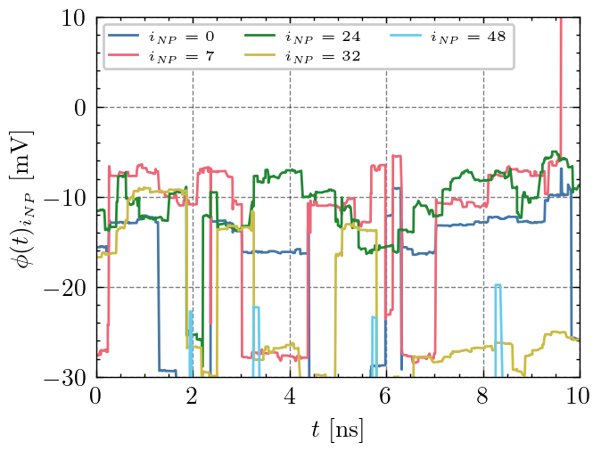
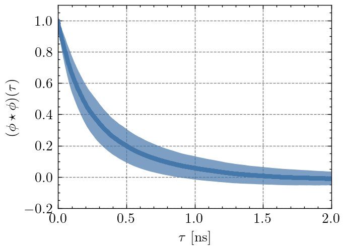
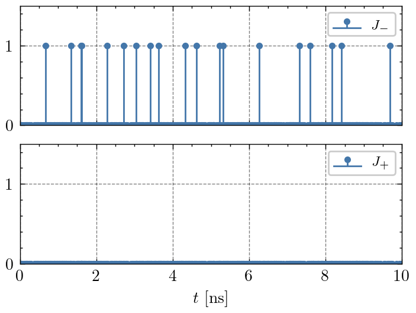
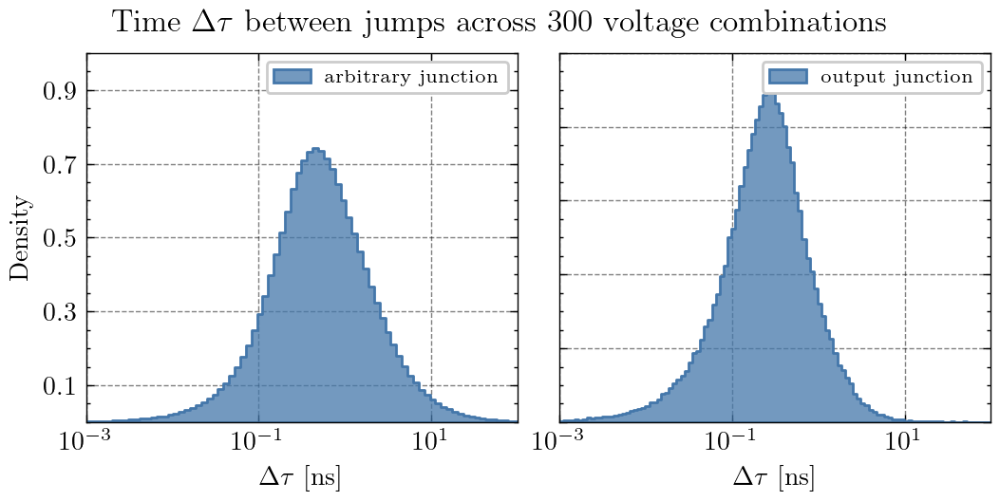
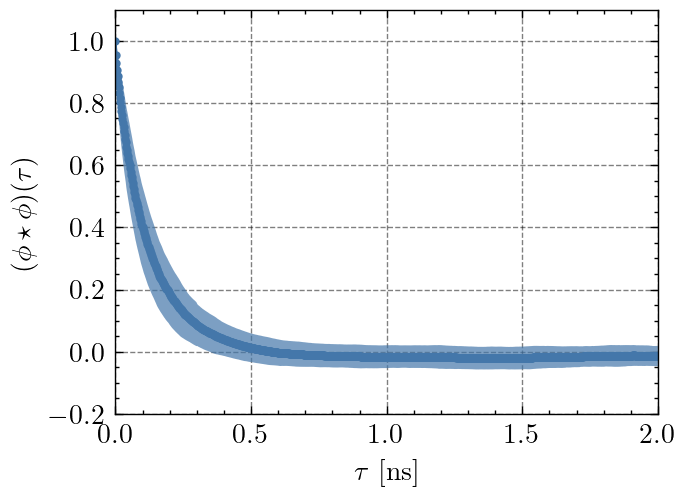

# Autocorrelation
---
## Basics
For a given network of nanoparticles (NPs) with an evolving charge distribution $\vec{q}(t)$ and potential landscape $\vec{\phi}(t)$ at time $t$, we want to calculate the autocorrelation of the potential landscape or resulting electric currents $I(t)$.
The electric current of the output electrode is given as
$$I(t) = e \cdot \frac{\Gamma_+(t) - \Gamma_-(t)}{t}$$
with $t$ as the time passed during a **single** jump.
The potential landscape is given as
$$\vec{\phi}(t) = C^{-1}\cdot \vec{q}(t)$$
We calculate the autocorrelation $X \star X $of a random variable $X$ at lag $\tau$ as
$$(X \star X)(\tau)= \frac{E[(X_t - \mu)(X_{t + \tau} - \mu)]}{\sigma^2}$$
with $\mu$ and $\sigma$ for mean and standard deviation.

## Potential Landscape

For a simulation of a 7 x 7 network after equilibration, we execute $N_{Jumps}$ Monte Carlo steps resulting in a potential time series $\phi(t)_{i_{NP}}$ for $49$ NPs of index $i_{NP}$. Above we show some example potential series.
When calculating the autocorrelation for those potentials and average across the whole network the resulting plot shows a **ns time scale**.

The indicated error results from calculating the autocorrelation for $300$ combinations of control electrode voltages.

## Electric Currents

As there is no difference in autocorrelation between $\phi(t)$ and $I(t)$ we skip this part and instead measure the time passed $\Delta \tau$ in between occured jumps for a given junction. The plot above shows how often jumps occure at the output electrode junctions. There are always two jumps to be considered: $J_-$ as Output-to-Network and $J_+$ as Network-to-Output jumps. In the upper case, the resulting electric current is of negative sign. 

Here we compare the distribution $\Delta \tau$ for an arbitrary junction or the output electrode junction.

## System Size

The plots below correspond to networks of $9$ NPs. The time scale is shifted to smaller values. 

