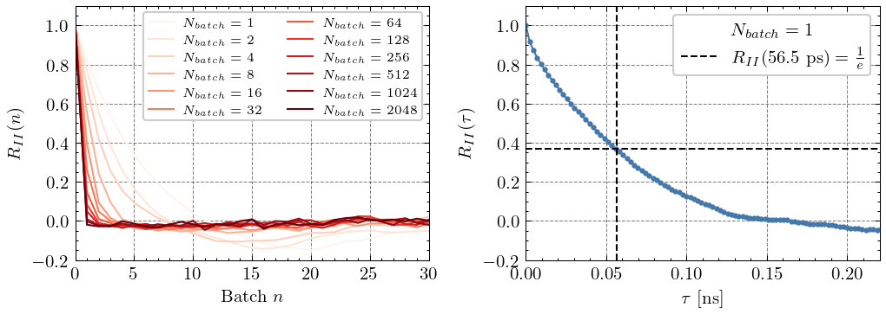
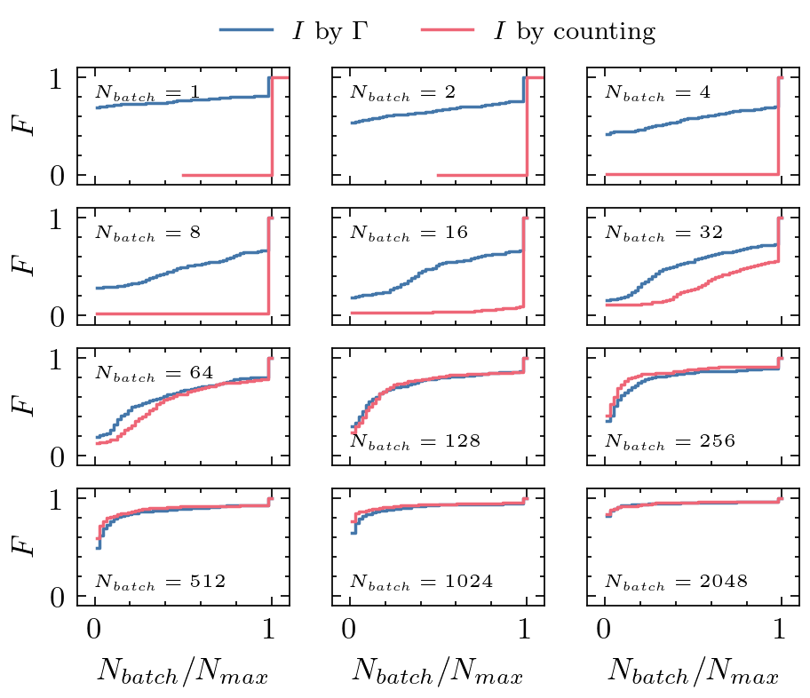
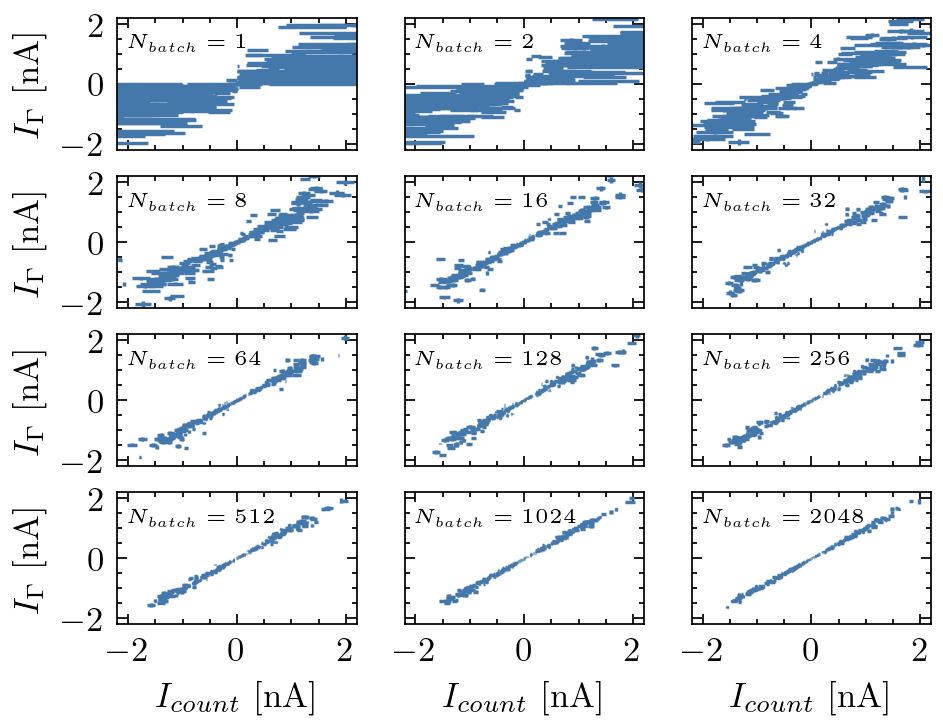
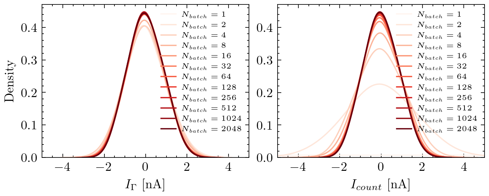
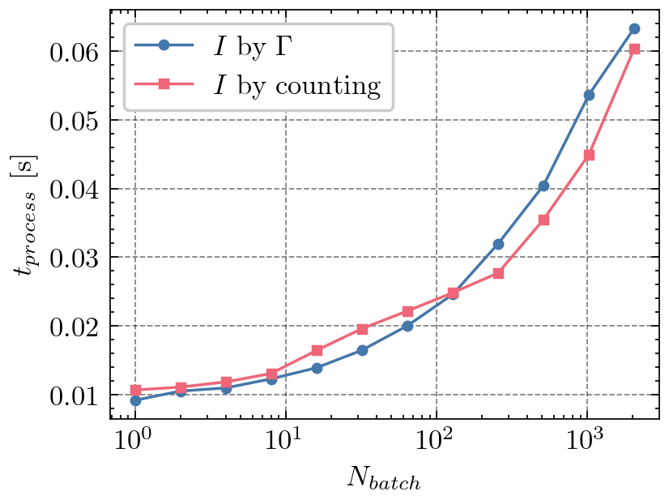

# Electric Current Estimation
---
## Basics
For a given network of nanoparticles (NPs) with an evolving charge distribution $\vec{q}(t)$ and potential landscape $\vec{\phi}(t)$ at time $t$, we want to estimate the average electric current $I$ for a particular NP-to-NP or NP-to-Electrode junction (node-to-node in general). For this we consider fixed batches with $N_{batch}$ kinetic Monte Carlo Steps. For each of those batches we then calculate the electric current $I_{batch,n}$ using one of these two methods:
1. **Counting-Method:**
    Within batch $n$, we define two counters $J_+$ and $J_-$. If an elementary charge $e$ jumps from node $i$ to node $j$ we increase $J_+$ by an $e$. If a charge jumps from $j$ to $i$, we increase $J_-$ by an $e$. After $N_{batch}$ jumps, we calculate
    $$ I_{batch,n} = \frac{J_+ - J_-}{t_n} $$
    with $t_n$ as the time passed in batch $n$. The issue in this method is the strong dependence of $I_{batch}$ from $N_{batch}$ as small values in $N_{batch}$ might even lead to zero jumps at all for the consider node-to-node junction. Additionaly, if $N_{batch}$ is large we might average over changes in $\vec{q}(t)$ or $\vec{\phi}(t)$ occuring on smaller time frames. Therefore this mehod is only suited for estimating $I$ of the steady network state at large $N_{batch}$ values.  
2. **$\Gamma$-Method:**
    For a given time $t$ the electric current in between node $i$ and node $j$ can be defined as $I(t) = e \cdot (\Gamma_+(t) - \Gamma_-(t))$ with $\Gamma_+(t)$ as the rate for a charge jumping event from $i$ to $j$ and $\Gamma_-(t)$ as the rate for a charge jumping event from $j$ to $i$. The average electric current for a batch, can then be calculated as
    $$ I_{batch,n} = \frac{e}{t_n} \sum_{m=0}^{N_{batch}} (\Gamma_+(t_m) - \Gamma_-(t_m)) \cdot t_m $$
    with $t_n$ as the total time passed in batch $n$ and $t_m$ as the time passed for single jump $m$. Here we have the major advantage compared to **Counting-Method** that there is an electric current $I(t_m)$ in each time step $t_m$. This allows us to also cover smaller $N_{batch}$ values, especially suited for time dependent simulations or whenever the network states $\vec{q}(t)$ or $\vec{\phi}(t)$ are non steady on small time frames.

Eventually, as soon as one of those two methods calculated a couple of batched electric currents, for a steady state the final average electric current estimate is given as
$$ I = \frac{1}{N} \sum_{n=0}^{N} I_{batch,n} $$
with $N$ as the number of batches. Here we assume that in all batches about the same time $t_1 \approx t_2 \approx ... \approx t_n$ passed. Otherwise we would use
$$ I = \frac{1}{T} \sum_{n=0}^{N} I_{batch,n} \cdot t_n $$
The error of our estimated mean is given as 
$$ e_I = \frac{\sigma}{\sqrt{N}} $$
in case the $I_{batch,n}$ are non-correlated. The Figure below shows the autocorrelation $R$ of the electric currents $I_{batch,n}$ (here just denoted as $I$) calculated using the **$\Gamma$-Method**. Each $R$ is based on $300$ different electrode voltage combinations. $I$ is associated to the current between a NP and an electrode. The system was firstly equilibrated.

The left plot argues that batched electric currents decorrelate for about $N_{batch} > 100$. The right plot shows a correlation length / response time of the electric current of about $56.5$ ps (here defined as the $\tau$ value for which $R = 1/e$). The correlation length might vary for different system sizes. Here we used a $7x7$ network of NPs and $8$ electrodes.

## Counting vs. $\Gamma$
The average electric current $I$ is calculated based on $N_{batch}$ batches. The amount of batches needed is determined by the relative standard error $\frac{e_I}{I}$. If the relative standard error falls below $5\%$ the simulation stops. However, some voltage configurations might not reach $5\%$ (trivial example all voltages equals zero). For these cases we also define a maximum amount of batches $N_{max}$ so that the simulation duration doesn't explode. The Figure below shows the cimulative distribution function $F$ of the $N_{batch}/N_{max}$ based on $300$ voltage configurations in a $7x7$ system, i.e. the amount of runs reaching the limit or not convergig.  

We see that for $N_{batch} > 100$ there is no difference between the **counting** and **$\Gamma$** algorithm. For small values of $N_{batch}$, the counting algorithmn does not converge most cases.
Correspondingly, when the batch size is small, the actual average electric current when counting $I_{count}$ is widely spreaded across the x-axis. For large values of $N_{batch}$ both algorithms produce the same electric currents.

Accordingly, looking at the probability density of $I_\Gamma$ and $I_{count}$ we see the wrong estimations in $I_{count}$ for small $N_{batch}$ values as a broad distribution. $I_\Gamma$ already resamples a decent distribution at $N_{batch}=4$.

Finally, the lower figure compares the simulation duration per voltage configuration. Counting takes less as we increase $N_{batch}$ above $100$, while $\Gamma$ is faster below this threshold.

