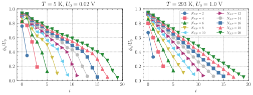

## Characteristic Timescale
For a string of $N_{NP}$ nanoparticles (NP) each NP $i$ is defined by its potential state $\phi_i$. We attach a time-dependent input electrode to the first NP of index $0$ and an output electrode at the last nanoparticle of index $N_{NP}-1$. Then we run a simulation for each input voltage step at step size $\Delta t = 1e-10 \text{ s}$. This procedure is repeated $200$ times to get proper statistics for each observable at any given time step. We observe the potential landscape $\vec{\phi}(t)$ and the output electrode response which is either an electric current $I(t)$, if the output electrode is grounded, i.e. has a fixed voltage of $U_1 = 0 \text{ V}$, or a voltage $U_1(t)$ if the output electrode is floating. In the latter case charges can only enter or exit the system via the input electrode.
### Direct Current Input Signal
First we force the input electrode voltage to have a constant value $U_0(t) = U_0$ which represents a direct flow of current entering the system. As we expect crucial differences when charges may or may not be able to exit the system from the output electrode we will cover both types of output electrodes.
First the output is grounded allowing charges to enter the system at the one end and exit the system at the other end. Resulting in a constant flow of current from high to low potential (left to right). This flow will be governed by Coulomb Blockade, i.e. nonlinear if temperature is low and $U_0$ small. For high temperature or input voltage ranges we expect the system to respond linearly, similar to a Kirchhoff's circuit. The figure below compares linear and nonlinear regime of the scaled potential landscape $\vec{\phi}/U_0$ for different string length at their equilibrium after relaxation.
<figure style="text-align: center">

<figcaption>Equilibrated potential landscape scaled by constant input voltage for a string of nanoparticles and grounded output electrode. Nonlinear response at low temperature and small input voltages are compared to linear response at room temperature and large input voltage.</figcaption>
</figure>