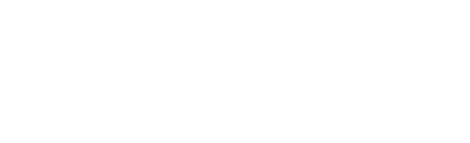

## Time dependent Nanoparticle Networks
### Nanoparticle Network
We study the effect of time dependent signals on nanoparticle (NP) networks. The NP network is of cubic shaped defined by its number of NPs in $x,y,z$ dircetion ($N_x,N_y,N_z$). There is always one input electrode and one output electrode. The input electrode is defined by voltage $U_0(t)$ evaluated at step sizes of $\Delta t$. The output electrode is either grounded $U_1(t) = 0$ or floating. In the first case our major observable is the electric current in between network and output $I$. In the latter case charges cannot exit or enter the system at the output resulting in our observable to be the output voltage $U_1(t)$. The network always sits on an oxide above a substrate which provides an insulating environment. For now we don't have any disorder in the system. The oxide layer is large enough so that there is no current from network to substrate. NPs are of same size $r_{NP}=10 \text{ nm}$. The shell-to-shell spacing between NPs is $d=1 \text{ nm}$. This leads to equal self-capacitance $C_{i}:=C_{s}$ for each NP and equal mutual capacitance in between NPs $C_{ij}:=C_{m}$. The resistance of each tunnel junction is also fixed and equal for any junction in the system $R_{ij} = 25 \text{ M}\Omega :=R$.
### Electrostatics for a string of NPs
When we think of our system in terms of electrostatics a NP-NP junction can be understood as a capacitor at $C_{m}$ and a resistor of $R$ in parallel with NPs as nodes. When we put exemplarly three NPs in a string ($N_x=3,N_y=1,N_z=1$) we get

<figure style="text-align: center;">
  
  <figcaption>Figure 1. A string of three NPs at equal size and equal junction resistances. Electrodes are driven at voltage U0 and U1.</figcaption>
</figure>

as a simple circuit diagram. Now for the potential $\phi_i(t)$ on node/NP $i$ in the string we can define

$$
C_m \frac{d(\phi_i-\phi_{i-1})}{dt} + \frac{\phi_i - \phi_{i-1}}{R} + C_s \frac{d \phi_i}{dt}= C_m \frac{d(\phi_{i+1}-\phi_{i})}{dt} + \frac{\phi_{i+1} - \phi_{i}}{R}
$$

which is only true if we assume ohmic resistances. The junction behaves ohmic when thermal energy is much larger than the charging energy which would e.g. be the case for room temperature $T=293 \text{ K}$. For a non-floating output electrode we can use the Ansatz:

$$
\phi_i(t) = U_0(1-\frac{i}{N+1})+\sum_{n=1}^N a_n \sin(\frac{n \pi i}{N+1})e^{-t/\tau_n}
$$

When we put the Ansatz into our diffusion-like equation we can solve it for the time scale of mode $n$:

$$
\tau_n = \frac{R[C_s+2C_m(1-\cos(\frac{n\pi}{N+1}))]}{2(1-\cos(\frac{n\pi}{N+1}))}
$$

When we assume that each potential starts at zero potential $\phi_i(0)=0$ we get:

$$
a_n = -\frac{2U_0}{N+1}\sum_{i=1}^N (1 - \frac{i}{N+1})\sin(\frac{n\pi i}{N+1})
$$
### High Temperature Limit
Starting with simulation at $T=293 \text{ K}$ we should be able to compare our kinetic Monte Carlo (KMC) model simulation results with the calculations from the previous chapter. We first of all want to have a look at the relaxation behavior of the network. Time step is fixed at $\Delta t = 0.1 \text{ ns}$, output is grounded $U_1(t)=0 \text{ V}$ and we also fix the input voltage to $U_0(t)=0.1 \text{ V}$. Then averaging across mutiple KMC runs we measure the node potential relaxation time series for each NP in the network. The network is defined to be a string of length $N$.